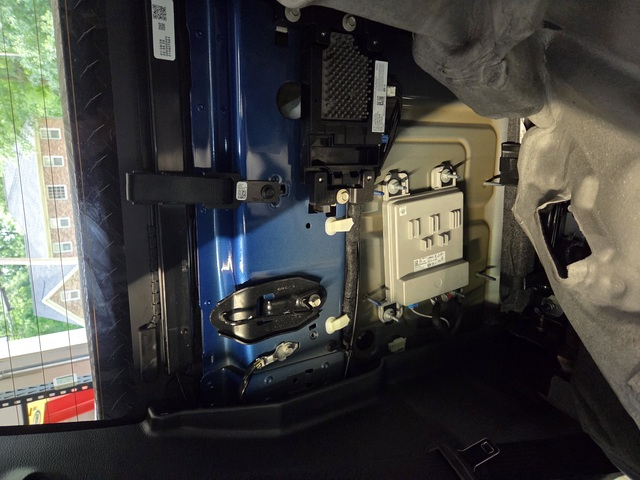
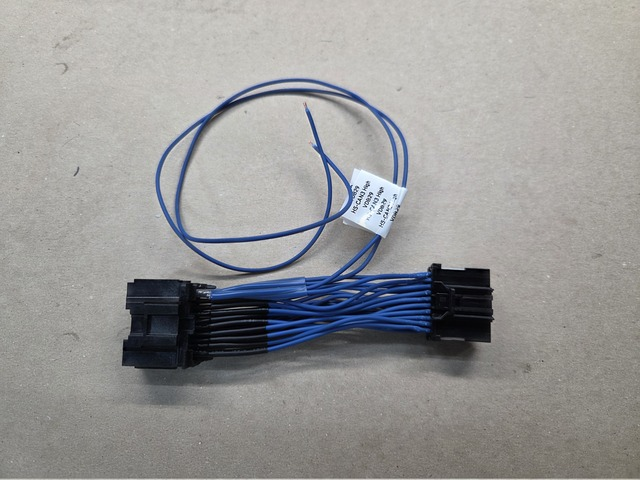
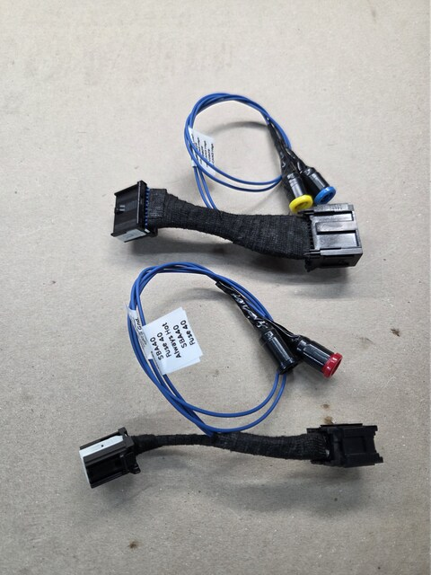
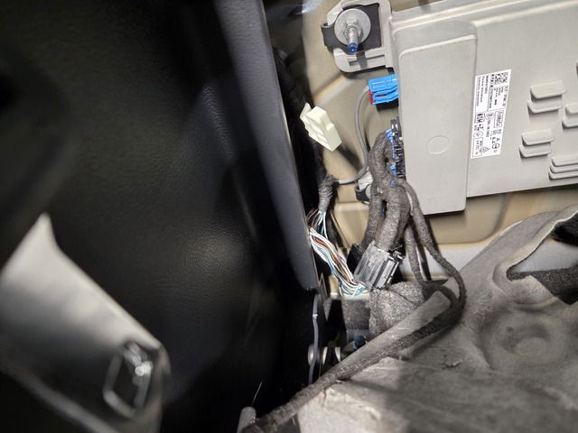
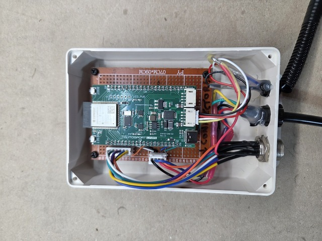
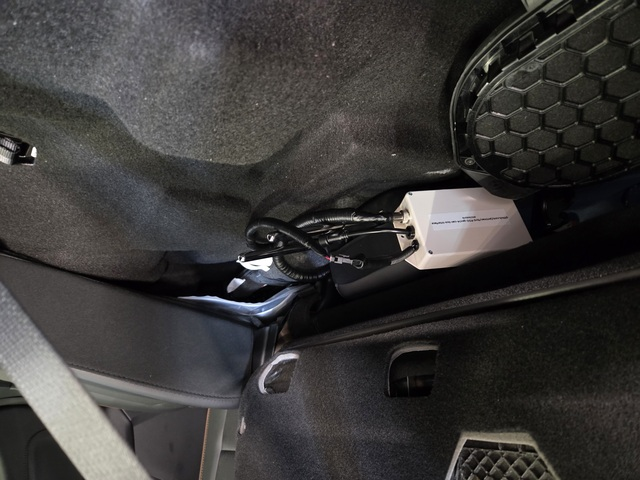
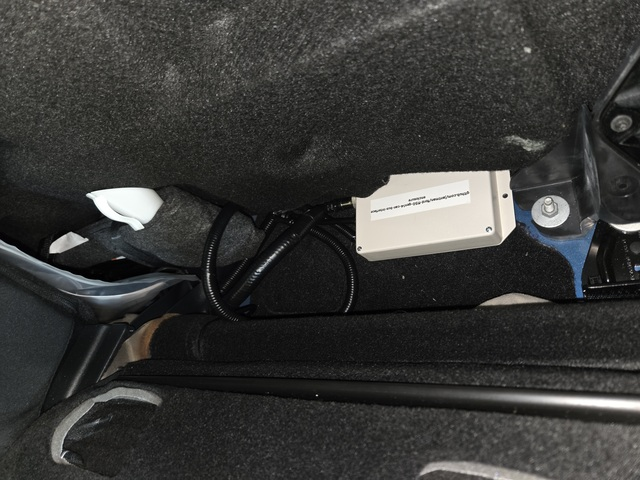
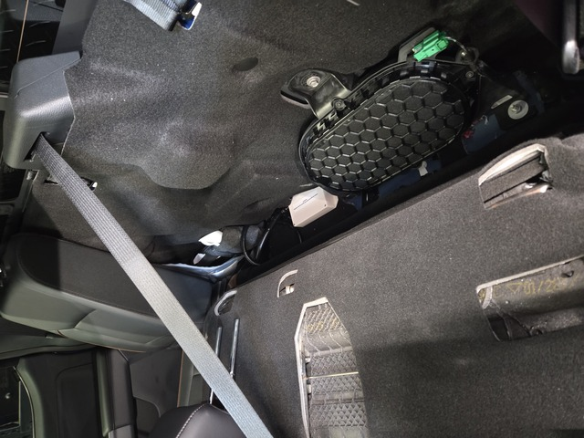
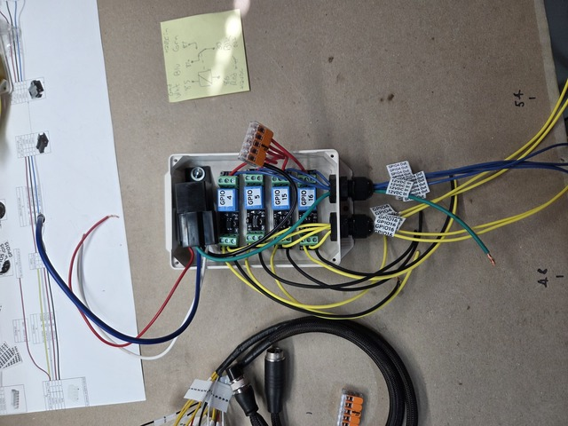
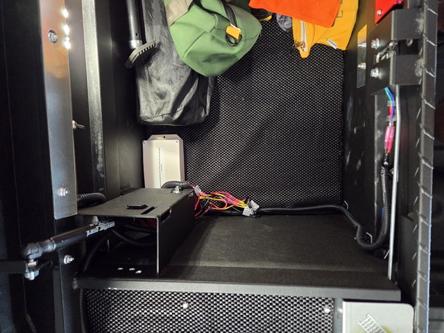

# Ford F150 Gen14 CAN bus Interface

[](https://github.com/jantman/ford-f150-gen14-can-bus-interface/actions/workflows/ci.yml)

Interface for doing various things in response to messages on the CAN bus of my 2025 (Generation 14) Ford F150, along with details of construction, initial investigation/experiments, wiring info, etc.

## What does it do?

* Trigger a relay for OEM-style aftermarket bed lights, when the CHMSL bed lights are on.
* Allow the truck bed toolbox to be unlocked via two buttons, only when the doors are unlocked and the vehicle is in park.
* ... whatever else I think of in the future? (there's substantial room for expansion built-in)

## Contents - What's Here?

* [experiments/](experiments/) - Initial investigation and experiments with the CAN bus as well as vehicle-specific wiring and connector information.
* [f150_wiring_notes.md](f150_wiring_notes.md) - Information for my 2025 F150 Lariat V8 on what circuits are in what connectors, etc.

## Software

This project implements a Ford F150 Gen14 CAN bus interface using Arduino Framework with PlatformIO on the AutoSport Labs ESP32-CAN-X2 development board.

### Features

* Monitors CAN bus messages for bed lights, door locks, transmission park status, and battery state
* Controls bed light relay based on vehicle puddle lamp status with manual override capability
* Manual bed light control via double-click button (independent of CAN bus signals)
* Provides secure toolbox unlock functionality (only when vehicle is unlocked and in park)
* Comprehensive logging and error handling
* Modular, maintainable code architecture

### Testing

This project includes comprehensive automated testing:

* **Native Unit Tests**: 49 tests covering GPIO control, CAN message parsing, state management, and integration scenarios
* **Continuous Integration**: Automated testing on all pushes and pull requests
* **Build Verification**: Automatic ESP32-S3 firmware build validation

Run tests locally:
```bash
# Run all native tests
pio test -e native

# Run tests with verbose output
pio test -e native -v

# Run specific test categories
pio test -e native --filter "test_gpio*"
pio test -e native --filter "test_can_protocol*"
```

### Building and Flashing

#### Prerequisites

1. **Install PlatformIO Core** or **PlatformIO IDE**:
   - **Option A - PlatformIO Core (Command Line)**:
     ```bash
     pip install platformio
     ```
   - **Option B - PlatformIO IDE**: Install the PlatformIO extension in VS Code

2. **Hardware Requirements**:
   - AutoSport Labs ESP32-CAN-X2 development board
   - USB cable for programming
   - CAN bus connection to vehicle (HS-CAN3 at 500kbps)

#### Building the Project

1. **Clone and navigate to the project**:
   ```bash
   git clone <repository-url>
   cd ford-f150-gen14-can-bus-interface
   ```

2. **Build the project**:
   ```bash
   pio run
   ```

#### Flashing to ESP32

1. **Connect the ESP32-CAN-X2 board** via USB

2. **Flash the firmware**:
   ```bash
   pio run --target upload
   ```

3. **Monitor serial output**:
   ```bash
   pio device monitor
   ```

#### Configuration

Before flashing, you may want to adjust the pin assignments in `src/config.h`:

```cpp
#define BEDLIGHT_PIN 5          // Output: Controls bed light relay
#define TOOLBOX_OPENER_PIN 4    // Output: Controls toolbox opener relay
#define TOOLBOX_BUTTON_PIN 17   // Input: Toolbox unlock button
#define SYSTEM_READY_PIN 18     // Output: System ready indicator

// Available for future use (previously LED indicators):
// GPIO15 - Available (was UNLOCKED_LED_PIN)
// GPIO16 - Available (was PARKED_LED_PIN)
```

#### Troubleshooting

- **Upload fails**: Ensure the ESP32 is in download mode (hold BOOT button while pressing RESET)
- **CAN messages not received**: Verify CAN bus connections and 120Ω termination
- **⚠️ IMPORTANT - No CAN messages**: If no CAN messages are received, disable hardware filtering for debugging:
  ```cpp
  // In src/config.h, change:
  #define ENABLE_HARDWARE_CAN_FILTERING 0
  ```
  Recompile and flash, then use `can_debug` command to see all CAN traffic
- **No serial output**: Check that `ARDUINO_USB_CDC_ON_BOOT=1` is set in platformio.ini
- **Memory issues**: Monitor free heap in serial output; reduce debug level if needed

#### Interactive Serial Commands

The firmware includes interactive debugging commands accessible via the serial monitor. Connect at 115200 baud and type commands to diagnose issues:

**Available Commands:**

- `help` or `h` - Show available commands
- `can_status` or `cs` - Display detailed CAN bus status and diagnostics  
- `can_debug` or `cd` - Monitor ALL CAN messages for 10 seconds (useful for verifying bus activity)
- `can_reset` or `cr` - Perform full CAN system recovery/reset
- `can_buffers` or `cb` - Show CAN buffer status and message loss detection
- `system_info` or `si` - Show system information (memory, GPIO states, etc.)

**Example Usage:**

```bash
# Open serial monitor
pio device monitor

# In the serial monitor, type commands:
help                    # Show all available commands
can_status             # Check CAN bus health
can_debug              # Monitor all CAN traffic for 10 seconds
can_buffers            # Check for message loss and buffer overflows
```

**Monitoring CAN Buffer Health:**

The MCP2515 controller has very limited hardware buffers (only 2 messages). Use the buffer monitoring features to detect potential message loss:

```bash
can_buffers            # Check buffer overflow detection
can_status             # Shows suspected overflow count in statistics
```

**Debugging CAN Issues:**

If you're seeing "CAN bus timeout - no activity" errors:

1. **Check hardware connections**: Use `can_status` to see raw TWAI driver state
2. **Monitor bus activity**: Use `can_debug` to see if ANY messages are being received
3. **Verify target messages**: Look for `[TARGET]` markers in debug output indicating your desired message IDs
4. **Check error counters**: High RX/TX error counts in `can_status` indicate bus issues
5. **Monitor for message loss**: Use `can_buffers` to check for buffer overflows
6. **Reset if needed**: Use `can_reset` to recover from driver errors

**Buffer Overflow Detection:**

The system includes monitoring for CAN message loss due to the MCP2515's limited 2-message hardware buffers:

- **Automatic monitoring**: Runs every 100ms during normal operation
- **Heuristic detection**: Monitors for sudden message cessation during active periods
- **Overflow warnings**: Logged when potential overflows are detected
- **Diagnostic command**: Use `can_buffers` for detailed buffer analysis
- **Statistics tracking**: Overflow counts included in `can_status` output

Signs of buffer overflow:
- Sudden stops in message reception during busy periods
- "Suspected buffer overflow" warnings in logs
- Message bursts following periods of silence
- High overflow counts in statistics

If overflows are detected, consider:
1. Reducing main loop delay (currently 10ms)
2. Increasing `MAX_MESSAGES_PER_LOOP` (currently 10) 
3. Using ESP32 TWAI controller instead of MCP2515 for larger buffers
4. Implementing message filtering to reduce processing load

The diagnostic output shows:
- TWAI driver state (should be "1" for RUNNING)
- Messages in RX queue (indicates bus activity even if not processed)
- Error counters (should be low, <128 for healthy operation)
- Raw message traffic with IDs and data bytes

#### Development

The code is organized into modules:
- `main.cpp` - Main application loop
- `config.h` - Pin definitions and constants
- `can_manager.h/cpp` - CAN bus communication
- `message_parser.h/cpp` - DBC message parsing
- `gpio_controller.h/cpp` - GPIO control
- `state_manager.h/cpp` - Vehicle state tracking
- `logger.h/cpp` - Logging utilities

## Hardware

### In-Cab Enclosure

[](photos/cab1.jpg)
[](photos/cab2.jpg)
[](photos/cab3.jpg)
[](photos/cab4.jpg)
[](photos/cab5.jpg)
[](photos/cab6.jpg)
[](photos/cab7.jpg)
[](photos/cab8.jpg)

A small project box enclosure containing an [AutoSport Labs ESP32-CAN-X2](https://www.autosportlabs.com/product/esp32-can-x2-dual-can-bus-automotive-grade-development-board/) development board, which combines an ESP32, dual can transceivers, and an automotive-grade 12-40VDC power supply. The ESP mounts to headers on a carrier board (simple 70x90cm protoboard) with connectors for IO, so that the ESP and/or carrier board can be removed from the enclosure without soldering. The enclosure exposes:

* A 4-pin connector for connection to the vehicle wiring harness +12VDC, ground, and the pair of CAN bus lines. In my specific vehicle, this uses a tee adapter that inserts between the factory wiring harness and the Audio DSP (amplifier) on the rear wall of the cab behind the rear passenger side seat.
* A 5-pin IO connector that exposes four GPIO pins as well as a blunt-cut wire inside the enclosure, for future use controlling devices in the cab or taking direct input.
* An 8-pin (7 populated) connector for a 7-wire harness that goes into the toolbox mounted in the bed of the truck, carrying six GPIO lines as well as a tap from an in-cab +12VDC circuit (SBA40) that is controlled by the ECU load-shedding logic. This will ensure that aftermarket accessories can't drain the battery too low.

Wiring diagrams for this enclosure can be seen in [PNG](./enclosure_wiring.png) or [SVG](./enclosure_wiring.svg).

### Bed Toolbox Enclosure

[](photos/bed1.jpg)
[](photos/bed2.jpg)

### Operation

Here is a video (Google Drive share) of the main features in operation: [https://drive.google.com/file/d/1tNBWQjMUxib8DWaKHlI0bFDWAgj8HGII/view?usp=sharing](https://drive.google.com/file/d/1tNBWQjMUxib8DWaKHlI0bFDWAgj8HGII/view?usp=sharing)

## History of Project

Vehicles have more and more intelligent components over time and fewer and fewer simple circuits. It was hard enough for me to find a truck that met most of what I wanted, and I was in a bit of a rush to get rid of my previous vehicle, so I ended up buying a truck with the 501A Mid trim package (no interior ambient lighting) and without the Bed Utility Package (no factory bed lighting, and no wiring for it). Beyond that, I also wanted the truck bed toolbox to... not have a giant key, and not have to be manually re-locked after unlocking. WeatherGuard makes a lock actuator kit that fits the toolbox, but on Gen 14 F150s only the low trim lines have a separate lock circuit for the tailgate (the Remote Release and Power Tailgate have more complicated systems controlled by a module inside the tailgate).

So, I set out to try and use the vehicle's CAN busses to do what I want. I knew from the factory service manual a pretty good idea of what the various busses are and where their circuits are accessible, and a vague idea of which busses would carry the messages I'm interested in, but not much more than that. I tried tapping into the busses using a Raspberry Pi with a [Waveshare CAN-FD HAT](https://www.waveshare.com/wiki/2-CH_CAN_FD_HAT), and quickly determined that my first choice connection point at the rear of the vehicle near the trailer connector didn't seem to be broadcasting any useful messages (at least when the vehicle wasn't running), so I resorted to doing my initial experimentation by back-probing the inline connectors behind the glove box.

After doing a bunch of research and not being able to find any write-ups on what I wanted (and specifically nothing on the exact CAN messages for door locks, bed lights, etc.), I resorted to writing (or, having GitHub CoPilot / Claude Sonnet) write me a small Python program ([can_action_analyzer.py](experiments/can_analyzer/can_action_analyzer.py)) to run on the Pi that would capture CAN traffic while I repeatedly toggled the door locks and bed lights, and would attempt to analyze the results for patterns clearly related to the toggling of state. I wasted most of a weekend on this without any reliable results.

The real breakthrough came when someone at work (thanks, Wolfy!) mentioned to me that they were playing around with [OpenPilot](https://github.com/commaai/openpilot), that it's Python based and knows how to do _all sorts_ of things with supported vehicles, and that the current-generation (Gen14) F150 is very well supported. That led me to the [opendbc](https://github.com/commaai/opendbc) project and then to [ford_lincoln_base_pt.dbc](https://github.com/commaai/opendbc/blob/ca8673cbc8f4709700ad223914dc359ed63a4835/opendbc/dbc/ford_lincoln_base_pt.dbc) which contains message information for everything I needed and much, much more! After that it was just a matter of asking CoPilot to write a console-based program to display the values of the signals I was interested in ([can_dashboard.py](experiments/message_watcher/can_dashboard.py)) to let me confirm that they change as expected - and they did!

Since I bought this truck brand new and intended to buy an extended warranty and keep it for quite a while, I was rather obsessed with not modifying the factory wiring at all - everything had to be able to be un-done, which meant making adapter harnesses to fit factory connectors. I determined that HS-CAN3 was the bus that carried all of the signals I was interested in, so it was another trip back to the service manual to enumerate all of the connectors that carry HS-CAN3 (see [f150_wiring_notes.md](f150_wiring_notes.md)). I ended up determining that the best for my needs was C3154A, the main connector for the audio amplifier mounted on the rear wall of the cab behind the rear passenger seat. This not only carries HS-CAN3 but also has power and ground available on the nearby C3154B connector, and the area behind the rear seat provides more than enough space to locate an enclosure for a small microcontroller as well as easy access to run wiring to the bed via the rear cab vents.

With that done, it was just a matter of sourcing the proper connectors, programming a microcontroller, and wiring everything up. See the relevant hardware and software sections above for the details.
